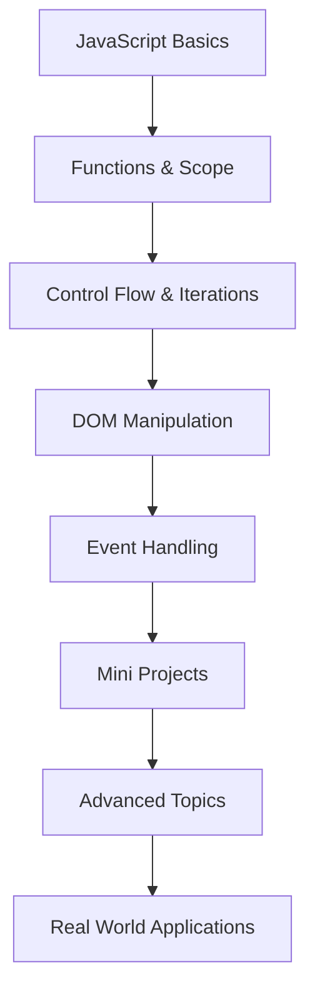

# JavaScript Learning Journey

A well-organized repository documenting my progress while following **Hitesh Choudhary's JavaScript** course. This collection includes notes, practice code, and mini projects focused on building strong fundamentals.

---

## About This Repository

This repository serves as my personal learning archive for JavaScript. I am systematically working through core concepts, practicing with code examples, and reinforcing knowledge by building small interactive projects.

**Main Objectives:**
- Build a solid foundation in JavaScript
- Practice concepts through hands-on coding
- Apply knowledge by creating functional mini-projects
- Maintain clean, organized code for future reference

---

## Topics Covered

### Fundamentals
- Variables and Data Types
- Type Conversion and Coercion
- Strings, Numbers, and Math Operations
- Date and Time handling

### Control Flow and Iterations
- Conditional statements (`if/else`, `switch`)
- Loops (`for`, `while`, `do...while`)
- Array methods (`forEach`, `map`, `filter`, `reduce`, `for...of`, `for...in`)

### Functions
- Function declarations and expressions
- Arrow functions
- Scope and hoisting
- IIFE (Immediately Invoked Function Expressions)

### DOM and Events
- Selecting and manipulating DOM elements
- Creating and removing elements
- Event listeners
- Mouse, keyboard, and other common events

### Advanced Concepts (In Progress)
- Classes and Object-Oriented Programming
- Asynchronous JavaScript
- Promises and Fetch API

---

## Mini Projects

| Project              | Key Concepts Demonstrated                  | Status      |
|----------------------|--------------------------------------------|-------------|
| Color Changer        | DOM manipulation, event handling, timers   | Completed   |
| BMI Calculator       | Form handling, calculations, dynamic UI    | Completed   |
| Digital Clock        | Date/Time API, real-time updates           | Completed   |
| Guess the Number     | Game logic, user input validation          | Completed   |

These projects helped solidify understanding of DOM interactions and event-driven programming.

---

## Repository Structure

```
JavaScript/
├── 01_basics/
├── 02_basics/
├── 03_basics/
├── 04_control_flow/
├── 05_iterations/
├── 06_dom/
├── 07_projects/
├── 08_events/
├── 09_advance_one/
├── 10_classes_and_oop/
├── 11_fun_with_js/
└── README.md
```

---

## Learning Workflow



---

## Progress Overview

| Module                     | Status         |
|----------------------------|----------------|
| JavaScript Basics          | Completed      |
| Functions & Scope          | Completed      |
| Control Flow               | Completed      |
| Iterations & Array Methods | Completed      |
| DOM Manipulation           | Completed      |
| Events                     | Completed      |
| Asynchronous JavaScript    | In Progress    |
| Promises & API Handling    | In Progress    |
| OOP in JavaScript          | In Progress    |

---

## Learning Resources

- **Primary Course**: Hitesh Choudhary's JavaScript Course
- Additional References: MDN Web Docs, JavaScript.info

---

## Future Goals

- Complete advanced JavaScript topics
- Build larger applications using modern frameworks
- Learn TypeScript
- Explore React.js for frontend development
- Start backend development with Node.js

---

## How to Use This Repository

1. Clone the repository: `git clone https://github.com/Ayush-apt/JavaScript.git`
2. Navigate to specific folders to explore topics
3. Open HTML files in the browser to see live examples and projects
4. Review code comments for explanations

---

Thank you for visiting. This repository will continue to grow as I progress in my JavaScript learning journey.

---

**Last Updated:** July 2026
